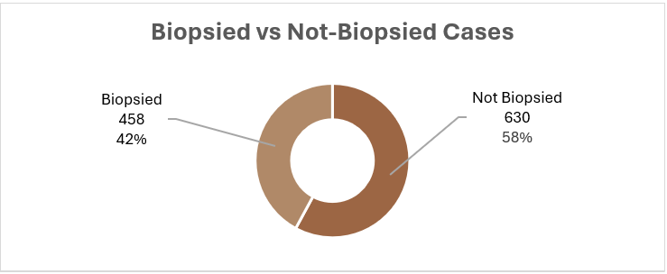
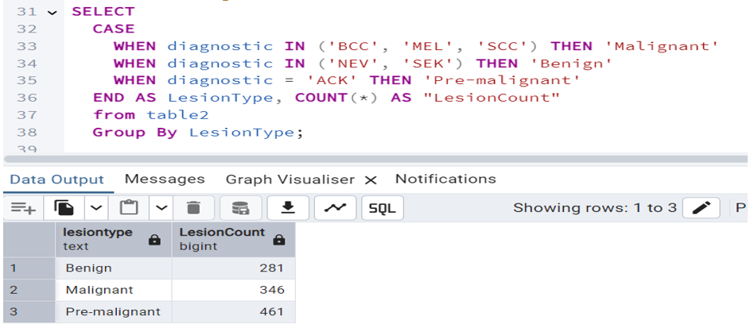
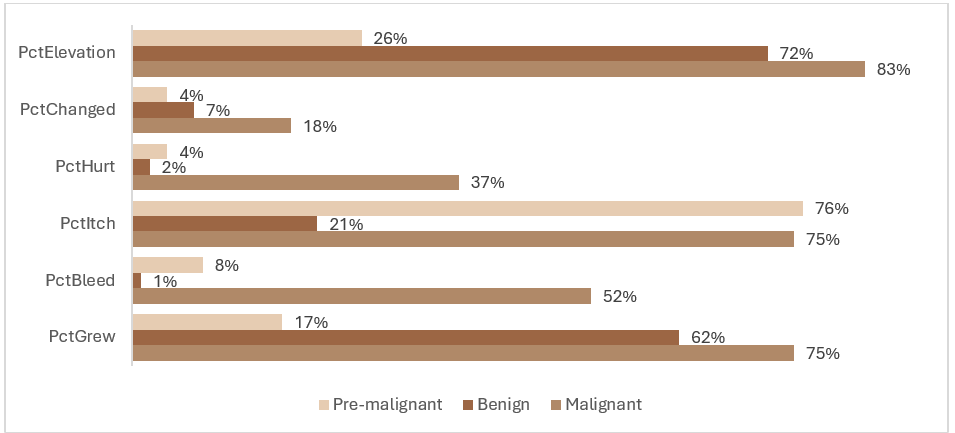
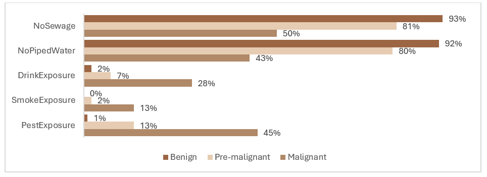

# DermAI Diagnostic: Skin Lesion Analysis for Cancer Risk

This project is a comprehensive SQL-based exploration of skin lesion data aimed at uncovering patterns associated with skin cancer risk, epidemiological trends, and clinical insights. With a dataset comprising 1,088 patients and lesions, the analysis provides meaningful health findings by investigating correlations between diagnostic outcomes, environmental factors, symptoms, and demographics.

## Dataset Overview

The dataset consists of two main tables:
- `table1`: Patient demographic and lifestyle data (age, gender, background, environmental exposures, cancer history)
- `table2`: Lesion characteristics (diagnostic type, region, symptoms, Fitzpatrick skin type, biopsy status, diameter, etc.)

## Project Objectives

Use SQL-based data exploration to:
- Identify and classify lesion types into malignant, pre-malignant, and benign
- Assess relationships between skin cancer and demographics (age, gender, ethnicity)
- Analyze environmental and behavioral factors (e.g., smoking, pesticide exposure)
- Evaluate symptomatic patterns (itching, bleeding, elevation, pain, changes)
- Compare biopsy confirmation rates across lesion categories
- Highlight vulnerable populations by skin type and background
- Identify most-affected body regions and Fitzpatrick skin types
- Recommend data-driven public health interventions

## Lesion Type Classification

- **Malignant**: Basal Cell Carcinoma (BCC), Squamous Cell Carcinoma (SCC), Melanoma (MEL)
- **Pre-malignant**: Actinic Keratosis (ACK)
- **Benign**: Nevi (NEV), Seborrheic Keratosis (SEK)

## Total Patients & Lesion Distribution

## Analytical Highlights

### Lesion Count by Categorization 

### Demographic Risk Factors
- **Age**: Malignancy rates increase after 30, especially among the 50+ group
- **Gender**: Men account for 66.8% of all lesion types
- **Ethnicity**: German and Pomeranian backgrounds had higher malignant lesion rates

### Fitzpatrick Skin Type
- Types 1–3 showed majority of malignant cases (especially Type 2)
- Darker skin types had fewer lesions but appeared under-biopsied
- Lighter tones showed higher vulnerability to UV-linked damage

### Biopsy Trends & Family History
- Biopsied lesions were larger and more symptomatic (ABCDE-aligned)
- Over 50% of older patients had a family history of cancer and higher malignancy confirmation rates

###  Symptom Trends
- **Malignant**: Most likely to itch (75%), bleed (52%), grow (75%), elevate (83%)
- **Pre-malignant**: High itching (76%), less bleeding/elevation
- **Benign**: Few symptoms, but 72% were elevated

### Lesion Body Region Patterns
- Most affected areas: Face, forearm, chest, nose, ear
- These are high UV-exposed regions and high-risk burn sites

### Environmental Risk Insights
- **Water/Sanitation Deficits**: Linked to early pre-malignant cases
- **Pesticide Exposure**: Found in 45% of malignant lesions
- **Smoking/Alcohol Use**: Slightly increased malignant incidence

## Tools & Techniques

- **SQL (PostgreSQL)**: CTEs, JOINs, Aggregations, CASE functions
- **Data Analysis**: Pattern recognition, symptom modeling
- **Public Health Framing**: Translating medical data into health policy insights
- **Visualization**: SQL, Excel

## Recommendations

### Raise Public Awareness
- Promote skin checks and UV risk education, especially for Types 1–3

### Target At-Risk Groups
- Screen older adults (30+), those with cancer history, and lesions showing alarming symptoms

### Sun Protection Advocacy
- Encourage SPF 30+ use, hats, long-sleeve clothing

### Infrastructure Improvements
- Boost dermatological access and water sanitation in under-resourced areas

### AI Diagnostic Potential
- Dataset can be structured for machine learning classification based on demographics, symptoms, Fitzpatrick type, and biopsy status

## Contact Me

If you have questions about this project or would like to connect:

-  [LinkedIn](https://www.linkedin.com/in/susandania/)
-  Email: susan.dania@outlook.com
-  [Portfolio Website](https://susandania.github.io)

